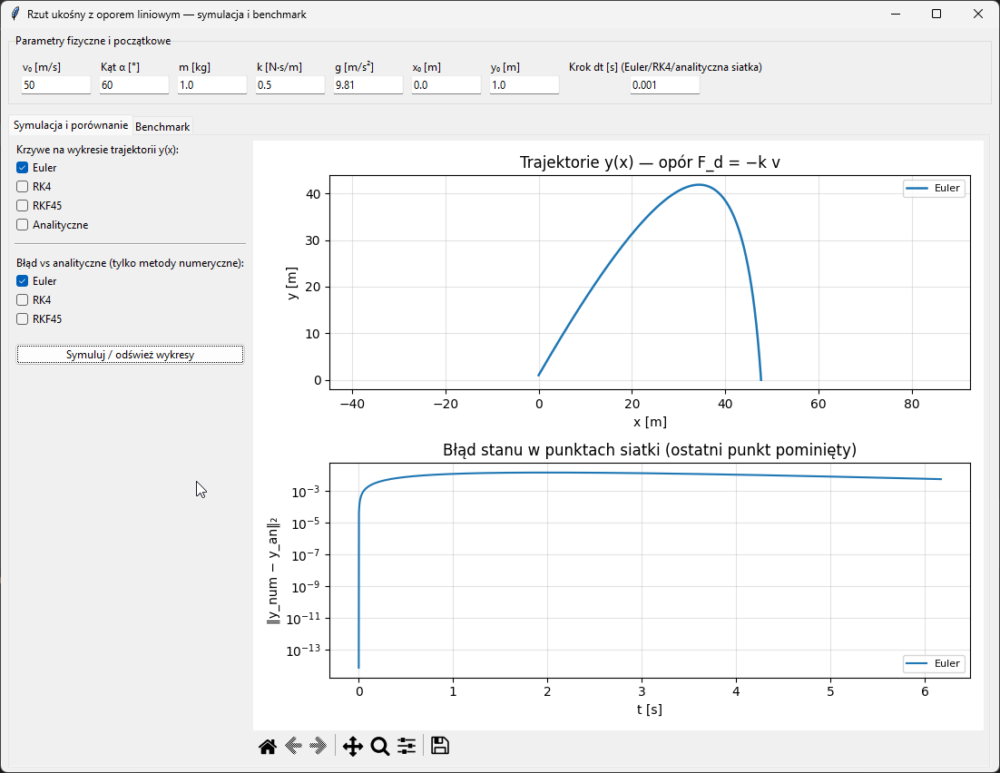
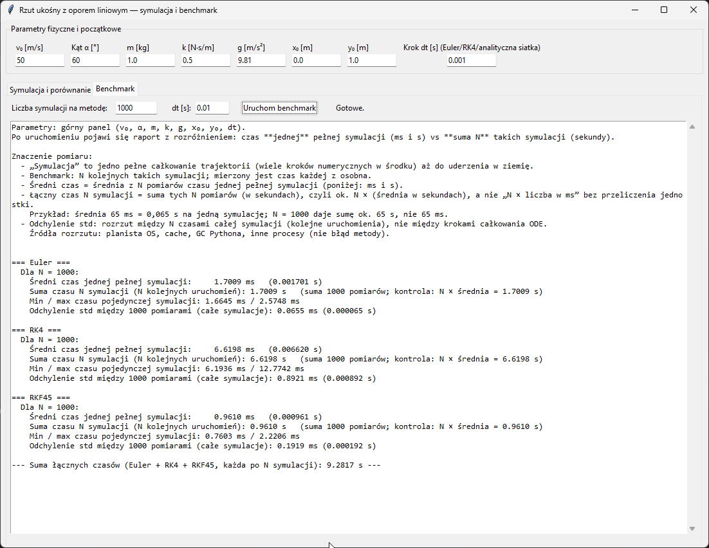

# Rzut ukośny z oporem liniowym

Symulacja trajektorii z oporem powietrza **proporcjonalnym do prędkości** (\(F_d = -k\mathbf{v}\)). Porównanie metod numerycznych z rozwiązaniem analitycznym, wizualizacja oraz benchmark wydajności.

## Model

Stan: \(\mathbf{y} = [x,\, y,\, v_x,\, v_y]^T\).

\[
\frac{dx}{dt} = v_x,\quad
\frac{dy}{dt} = v_y,\quad
\frac{dv_x}{dt} = -\frac{k}{m} v_x,\quad
\frac{dv_y}{dt} = -g - \frac{k}{m} v_y
\]

Szczegóły implementacji: `projectile/model.py`, rozwiązanie zamknięte: `projectile/analytical.py`.

## Metody numeryczne

| Metoda | Plik |
|--------|------|
| Euler | `projectile/solvers.py` |
| RK4 (Rungego-Kutty 4. rzędu) | `projectile/solvers.py` |
| RKF45 (Rungego-Kutty-Fehlberg, adaptacyjna para 4(5)) | `projectile/solvers.py` |

Całkowanie do momentu pierwszego uderzenia w podłoże (\(y \le 0\)): `projectile/simulation.py`.

## Struktura katalogów

```text
MetodyNumeryczne/
├── README.md
├── requirements.txt
├── main.py              # CLI: wykresy, benchmark, --gui
├── gui_app.py           # Aplikacja okienkowa (tkinter + matplotlib)
├── visualize.py         # Wykresy trajektorii i błędu (tryb skryptowy)
├── benchmark.py         # Pomiary czasu, raport tekstowy
└── projectile/
    ├── __init__.py
    ├── model.py         # Parametry ODE, ProjectileParams.from_speed_angle(v0, α, …)
    ├── analytical.py
    ├── solvers.py
    └── simulation.py
```

## Wymagania

- Python 3.10+ (zalecane)
- `numpy`, `matplotlib`
- **tkinter** — zwykle w zestawie z Pythonem na Windowsie (do GUI)

## Instalacja

```powershell
cd ścieżka\do\MetodyNumeryczne
python -m venv .venv
.\.venv\Scripts\Activate.ps1
pip install -r requirements.txt
```

## Uruchomienie

### Tryb konsoli (`main.py`)

```powershell
python main.py                    # wykresy matplotlib + benchmark (domyślnie N=1000 / metoda)
python main.py --plots-only       # tylko wykresy
python main.py --bench-only       # tylko benchmark (bez okien wykresów)
python main.py --dt 0.005         # inny krok całkowania dla Eulera/RK4 i siatki analitycznej
```

### Aplikacja okienkowa

```powershell
python gui_app.py
# lub
python main.py --gui
```

W GUI można ustawić m.in. \(v_0\), kąt \(\alpha\) [°], \(m\), \(k\), \(g\), \(x_0\), \(y_0\), krok `dt`, wybrać krzywe na wykresach oraz uruchomić benchmark na **N** powtórzeniach (osobna zakładka). Raport benchmarku rozróżnia **średni czas jednej pełnej symulacji** (np. w ms) od **sumy czasu N symulacji** (w sekundach).

### Skrypty pomocnicze

```powershell
python visualize.py
python benchmark.py
```

## Benchmark — jak czytać wyniki

- **Jedna symulacja** = jedno pełne całkowanie trajektorii od startu do \(y \le 0\) (wewnątrz jest wiele kroków Eulera/RK4 lub kroków adaptacyjnych RKF45).
- **N symulacji** = N kolejnych takich pomiarów czasu.
- **Średni czas** — średnia z N czasów pojedynczych symulacji (często podawana w ms).
- **Suma czasu N symulacji** — suma tych pomiarów, w **sekundach**; powinna być bliska \(N \times\) średniej wyrażonej w sekundach (np. średnia 65 ms ≈ 0,065 s ⇒ dla \(N=1000\) suma ≈ 65 s, a nie 65 ms).
- **Odchylenie standardowe** liczone jest po **N czasach całych symulacji**; rozrzut wynika głównie z obciążenia systemu (OS, GC), a nie z dyskretyzacji ODE.

Pełny opis generuje funkcja `format_benchmark_report()` w `benchmark.py`.




